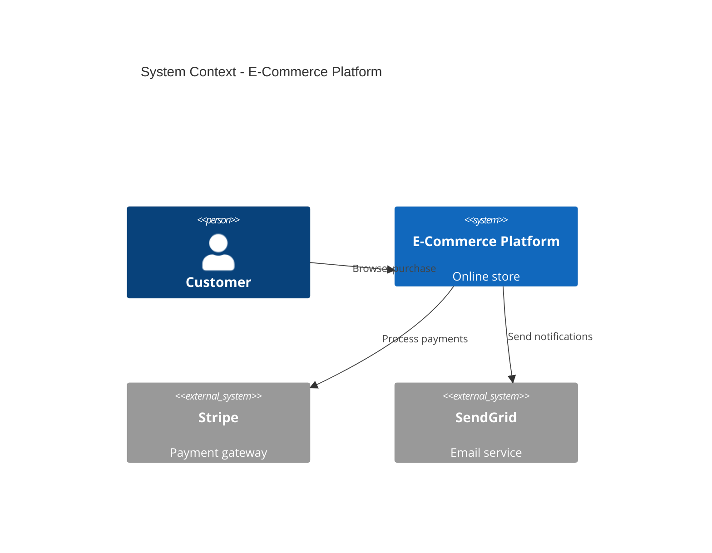

# Few-Shot Example: C4 Architecture Documentation for E-Commerce Platform

**Domain:** Business Analysis / Enterprise Architecture
**Skill Level:** Intermediate
**Pattern:** C4 model documentation (Context, Container, Component, Code)

---

## User Query

```
Need to document architecture for our e-commerce web application. We have frontend, backend API, database, payment gateway, and email service. How do I create proper architecture diagrams?
```

---

## Exemplary Response

┌─ ROUTING ──────────────────────────────────────────────────┐
│ Role: Business Analyst / Enterprise Architect              │
│ Confidence: HIGH (90%)                                     │
│ Modules: 19-business-analysis.md                          │
│ Approach: C4 Model (Simon Brown) - 4 levels of abstraction│
└────────────────────────────────────────────────────────────┘

## C4 Model Architecture Documentation

I'll create a complete C4 model for your e-commerce platform, starting from high-level context down to component details.

---

## Level 1: System Context Diagram

**Purpose**: Show system boundaries and external dependencies from business perspective.

**Audience**: Non-technical stakeholders (executives, product owners, business analysts)

```
┌─────────────────────────────────────────────────────────────────────────────┐
│                          SYSTEM CONTEXT DIAGRAM                             │
│                        E-Commerce Platform (v2.0)                           │
├─────────────────────────────────────────────────────────────────────────────┤
│                                                                             │
│                             EXTERNAL USERS                                  │
│                                                                             │
│         [Customer]                    [Administrator]                       │
│         Person                        Person                                │
│         ↓                             ↓                                     │
│         │ Browse, search,             │ Manage products,                    │
│         │ purchase products           │ orders, inventory                   │
│         │                             │                                     │
│         └─────────────┬───────────────┘                                     │
│                       ↓                                                     │
│        ┏━━━━━━━━━━━━━━━━━━━━━━━━━━━━━━━━━━━━┓                              │
│        ┃                                    ┃                              │
│        ┃    E-COMMERCE PLATFORM             ┃                              │
│        ┃    [Software System]               ┃                              │
│        ┃                                    ┃                              │
│        ┃    Allows customers to browse      ┃                              │
│        ┃    and purchase products online    ┃                              │
│        ┃                                    ┃                              │
│        ┗━━━━━━━━━━━━━━━━━━━━━━━━━━━━━━━━━━━━┛                              │
│                       ↓                                                     │
│         ┌─────────────┼─────────────┬──────────────┐                       │
│         ↓             ↓             ↓              ↓                       │
│   [Email System]  [Payment Gateway] [Shipping API] [Analytics]            │
│   SendGrid        Stripe            ShipStation    Google Analytics       │
│   External        External          External       External               │
│                                                                             │
│   • Order         • Process         • Calculate    • Track user           │
│     confirmations   payments          shipping      behavior              │
│   • Notifications • Refunds           rates       • Conversion            │
│                                     • Track         metrics               │
│                                       shipments                            │
│                                                                             │
└─────────────────────────────────────────────────────────────────────────────┘

RELATIONSHIPS:
1. Customer → E-Commerce Platform: HTTPS/443 (browsing, purchasing)
2. Administrator → E-Commerce Platform: HTTPS/443 (admin panel)
3. E-Commerce Platform → Email System: SMTP/API (send notifications)
4. E-Commerce Platform → Payment Gateway: HTTPS/API (process payments)
5. E-Commerce Platform → Shipping API: HTTPS/API (calculate shipping, track)
6. E-Commerce Platform → Analytics: JavaScript SDK (track events)
```

**Context Narrative:**

The E-Commerce Platform is the central software system that enables customers to browse a catalog, add items to a shopping cart, and complete purchases. Administrators use a dedicated admin panel to manage products, track orders, and handle inventory.

The system integrates with four external services:
- **SendGrid** for transactional emails (order confirmations, shipping updates)
- **Stripe** for payment processing (PCI-DSS compliant)
- **ShipStation** for shipping rate calculation and order fulfillment
- **Google Analytics** for business intelligence and user behavior tracking

---

## Level 2: Container Diagram

**Purpose**: Show major applications/services and data stores (high-level technology choices).

**Audience**: Technical stakeholders (developers, DevOps, architects)

```
┌─────────────────────────────────────────────────────────────────────────────┐
│                          CONTAINER DIAGRAM                                  │
│                        E-Commerce Platform                                  │
├─────────────────────────────────────────────────────────────────────────────┤
│                                                                             │
│   [Customer]                              [Administrator]                   │
│   Browser/Mobile                          Browser                          │
│        ↓                                        ↓                           │
│        │ HTTPS                                  │ HTTPS                     │
│        ↓                                        ↓                           │
│   ┌────────────────────────────┐  ┌────────────────────────────┐           │
│   │  WEB APPLICATION           │  │  ADMIN WEB APP             │           │
│   │  [Container: React SPA]    │  │  [Container: React SPA]    │           │
│   │                            │  │                            │           │
│   │  • Product catalog         │  │  • Product management      │           │
│   │  • Shopping cart           │  │  • Order management        │           │
│   │  • Checkout flow           │  │  • Inventory control       │           │
│   │  • User account            │  │  • Reporting               │           │
│   │                            │  │                            │           │
│   │  Tech: React 18, Redux,    │  │  Tech: React 18, Ant       │           │
│   │        TypeScript,         │  │        Design, TypeScript  │           │
│   │        Nginx (static)      │  │                            │           │
│   └────────────┬───────────────┘  └──────────┬─────────────────┘           │
│                │                              │                             │
│                │ API calls (JSON/HTTPS)       │                             │
│                ↓                              ↓                             │
│   ┏━━━━━━━━━━━━━━━━━━━━━━━━━━━━━━━━━━━━━━━━━━━━━━━━━━━━┓                   │
│   ┃         API APPLICATION                             ┃                   │
│   ┃         [Container: Node.js + Express]              ┃                   │
│   ┃                                                      ┃                   │
│   ┃         • REST API endpoints                        ┃                   │
│   ┃         • Business logic                            ┃                   │
│   ┃         • Authentication (JWT)                      ┃                   │
│   ┃         • Payment processing orchestration          ┃                   │
│   ┃                                                      ┃                   │
│   ┃         Tech: Node.js 20, Express 4, TypeScript     ┃                   │
│   ┃               Passport.js, Winston logging          ┃                   │
│   ┗━━━━━━━━━━━━━━━━┳━━━━━━━━━━━━━━━━━━━━━━━━━━━━━━━━━━━┛                   │
│                    ↓                                                        │
│      ┌─────────────┼────────────┬──────────────┬─────────────┐             │
│      ↓             ↓            ↓              ↓             ↓             │
│  ┌────────┐  ┌──────────┐  ┌────────┐    ┌────────┐   ┌──────────┐       │
│  │DATABASE│  │  CACHE   │  │ QUEUE  │    │FILE    │   │ SEARCH   │       │
│  │        │  │          │  │        │    │STORAGE │   │ ENGINE   │       │
│  │Postgres│  │  Redis   │  │RabbitMQ│    │  S3    │   │Elastic-  │       │
│  │SQL     │  │ Key-Val  │  │Message │    │ Object │   │ search   │       │
│  │        │  │          │  │ Broker │    │ Store  │   │          │       │
│  └────────┘  └──────────┘  └────────┘    └────────┘   └──────────┘       │
│      ↑             ↑            ↑              ↑             ↑             │
│      │             │            │              │             │             │
│      └─────────────┴────────────┴──────────────┴─────────────┘             │
│                                                                             │
│   API also connects to EXTERNAL SERVICES:                                  │
│   → SendGrid (SMTP/API) - emails                                           │
│   → Stripe (HTTPS/API) - payments                                          │
│   → ShipStation (HTTPS/API) - shipping                                     │
│                                                                             │
└─────────────────────────────────────────────────────────────────────────────┘

DATA FLOWS:
1. User → Web App: Browse products, add to cart (client-side state)
2. Web App → API: POST /api/orders (checkout)
3. API → Database: INSERT INTO orders, order_items
4. API → Payment Gateway: Charge credit card
5. API → Queue: Enqueue "order_confirmation_email" job
6. API → Shipping API: Calculate shipping, create label
7. Background Worker → Email Service: Send confirmation
8. API → Cache: GET/SET product catalog (TTL: 5min)
9. API → Search Engine: Full-text search on products
10. API → File Storage: Upload product images
```

**Container Descriptions:**

| Container | Technology | Purpose | Scale |
|-----------|------------|---------|-------|
| **Web Application** | React 18 SPA | Customer-facing storefront | Nginx static hosting, CDN |
| **Admin Web App** | React 18 SPA | Internal management interface | Nginx static, VPN-only access |
| **API Application** | Node.js + Express | Business logic, orchestration | 3 instances (load balanced) |
| **Database** | PostgreSQL 15 | Persistent data (orders, products, users) | Primary + read replica |
| **Cache** | Redis 7 | Session storage, product catalog cache | Master + replica |
| **Message Queue** | RabbitMQ | Async job processing (emails, exports) | 1 instance |
| **File Storage** | AWS S3 | Product images, invoices | Managed service |
| **Search Engine** | Elasticsearch 8 | Full-text product search | 2-node cluster |

---

## Level 3: Component Diagram (API Application)

**Purpose**: Show internal structure of a single container (major modules/classes).

**Audience**: Developers working on the system.

```
┌─────────────────────────────────────────────────────────────────────────────┐
│                       COMPONENT DIAGRAM                                     │
│                       API Application (Node.js)                             │
├─────────────────────────────────────────────────────────────────────────────┤
│                                                                             │
│   INCOMING REQUESTS (from Web App / Admin App)                             │
│                     ↓                                                       │
│          ┌──────────────────────┐                                          │
│          │  API GATEWAY         │                                          │
│          │  [Express Router]    │                                          │
│          │                      │                                          │
│          │  • Rate limiting     │                                          │
│          │  • CORS handling     │                                          │
│          │  • Request logging   │                                          │
│          └──────────┬───────────┘                                          │
│                     ↓                                                       │
│          ┌──────────────────────┐                                          │
│          │  AUTH MIDDLEWARE     │                                          │
│          │  [Passport.js]       │                                          │
│          │                      │                                          │
│          │  • JWT validation    │                                          │
│          │  • RBAC enforcement  │                                          │
│          └──────────┬───────────┘                                          │
│                     ↓                                                       │
│   ┌─────────────────┼───────────────────────────────────┐                 │
│   │                 ↓                                   │                 │
│   │  ┌───────────────────┐    ┌─────────────────────┐  │                 │
│   │  │ PRODUCT SERVICE   │    │  ORDER SERVICE      │  │                 │
│   │  │ [Component]       │    │  [Component]        │  │                 │
│   │  │                   │    │                     │  │                 │
│   │  │ • List products   │    │ • Create order      │  │                 │
│   │  │ • Search products │    │ • Get order status  │  │                 │
│   │  │ • Get by ID       │    │ • Calculate total   │  │                 │
│   │  │ • Update (admin)  │    │ • Apply discounts   │  │                 │
│   │  └─────────┬─────────┘    └──────────┬──────────┘  │                 │
│   │            ↓                          ↓             │                 │
│   │  ┌───────────────────┐    ┌─────────────────────┐  │                 │
│   │  │  CART SERVICE     │    │ PAYMENT SERVICE     │  │                 │
│   │  │  [Component]      │    │ [Component]         │  │                 │
│   │  │                   │    │                     │  │                 │
│   │  │ • Add item        │    │ • Process payment   │  │                 │
│   │  │ • Remove item     │    │ • Handle refund     │  │                 │
│   │  │ • Calculate total │    │ • Stripe API calls  │  │                 │
│   │  └─────────┬─────────┘    └──────────┬──────────┘  │                 │
│   │            ↓                          ↓             │                 │
│   │  ┌───────────────────┐    ┌─────────────────────┐  │                 │
│   │  │  USER SERVICE     │    │ SHIPPING SERVICE    │  │                 │
│   │  │  [Component]      │    │ [Component]         │  │                 │
│   │  │                   │    │                     │  │                 │
│   │  │ • Register        │    │ • Calculate rates   │  │                 │
│   │  │ • Login           │    │ • Create label      │  │                 │
│   │  │ • Update profile  │    │ • Track shipment    │  │                 │
│   │  └───────────────────┘    └─────────────────────┘  │                 │
│   │                                                     │                 │
│   └─────────────────────────────────────────────────────┘                 │
│                             ↓                                              │
│   ┌─────────────────────────────────────────────────────┐                 │
│   │             DATA ACCESS LAYER                       │                 │
│   │                                                     │                 │
│   │  ┌──────────────┐  ┌──────────────┐  ┌──────────┐ │                 │
│   │  │ REPOSITORIES │  │    CACHE     │  │  SEARCH  │ │                 │
│   │  │ (TypeORM)    │  │  (Redis)     │  │  (ES)    │ │                 │
│   │  │              │  │              │  │          │ │                 │
│   │  │• ProductRepo │  │• Session     │  │• Product │ │                 │
│   │  │• OrderRepo   │  │• Cart        │  │  Index   │ │                 │
│   │  │• UserRepo    │  │• Catalog     │  │          │ │                 │
│   │  └──────┬───────┘  └──────┬───────┘  └────┬─────┘ │                 │
│   │         ↓                  ↓               ↓       │                 │
│   └─────────┼──────────────────┼───────────────┼───────┘                 │
│             ↓                  ↓               ↓                          │
│       [PostgreSQL]         [Redis]      [Elasticsearch]                   │
│                                                                             │
│   CROSS-CUTTING CONCERNS:                                                  │
│   ┌─────────────────────────────────────────────────────┐                 │
│   │  • Logging (Winston) → CloudWatch                   │                 │
│   │  • Error Handling (centralized middleware)          │                 │
│   │  • Validation (Joi schemas)                         │                 │
│   │  • Event Bus (publish domain events to RabbitMQ)    │                 │
│   └─────────────────────────────────────────────────────┘                 │
│                                                                             │
└─────────────────────────────────────────────────────────────────────────────┘
```

**Component Responsibilities:**

| Component | Responsibilities | Dependencies |
|-----------|-----------------|--------------|
| **Product Service** | CRUD operations on products, search, filtering | ProductRepository, SearchEngine, Cache |
| **Order Service** | Order creation, status tracking, discount logic | OrderRepository, PaymentService, ShippingService |
| **Cart Service** | Add/remove items, calculate totals, session mgmt | Cache (Redis), ProductService |
| **Payment Service** | Payment processing via Stripe, refunds, webhooks | Stripe API, OrderRepository |
| **Shipping Service** | Rate calculation, label generation, tracking | ShipStation API |
| **User Service** | Authentication, registration, profile management | UserRepository, JWT library |

**Design Patterns Used:**
- **Service Layer Pattern**: Business logic encapsulated in services
- **Repository Pattern**: Data access abstraction (TypeORM)
- **Dependency Injection**: Services injected via constructor
- **Event-Driven**: Domain events published to message queue

---

## Level 4: Code Diagram (Order Service - Example)

**Purpose**: Show class structure and methods (actual implementation).

**Audience**: Developers implementing features.

```typescript
// src/services/OrderService.ts

import { OrderRepository } from '../repositories/OrderRepository';
import { PaymentService } from './PaymentService';
import { ShippingService } from './ShippingService';
import { EventBus } from '../infrastructure/EventBus';

export class OrderService {
  constructor(
    private orderRepo: OrderRepository,
    private paymentService: PaymentService,
    private shippingService: ShippingService,
    private eventBus: EventBus
  ) {}

  /**
   * Create new order from cart
   * @throws PaymentFailedError if payment processing fails
   */
  async createOrder(userId: string, cartItems: CartItem[]): Promise<Order> {
    // 1. Validate cart items
    this.validateCartItems(cartItems);

    // 2. Calculate totals
    const subtotal = this.calculateSubtotal(cartItems);
    const shippingCost = await this.shippingService.calculateShipping(
      cartItems,
      userId
    );
    const total = subtotal + shippingCost;

    // 3. Process payment
    const paymentResult = await this.paymentService.charge({
      userId,
      amount: total,
      currency: 'USD',
    });

    if (!paymentResult.success) {
      throw new PaymentFailedError(paymentResult.errorMessage);
    }

    // 4. Create order record
    const order = await this.orderRepo.create({
      userId,
      items: cartItems,
      subtotal,
      shippingCost,
      total,
      paymentId: paymentResult.transactionId,
      status: 'PENDING',
    });

    // 5. Publish domain event (async email notification)
    await this.eventBus.publish('order.created', {
      orderId: order.id,
      userId,
      total,
    });

    return order;
  }

  async getOrderStatus(orderId: string): Promise<OrderStatus> {
    const order = await this.orderRepo.findById(orderId);
    if (!order) {
      throw new OrderNotFoundError(orderId);
    }

    // Check shipping status if order is shipped
    if (order.trackingNumber) {
      const trackingInfo = await this.shippingService.trackShipment(
        order.trackingNumber
      );
      order.shippingStatus = trackingInfo.status;
    }

    return order.status;
  }

  private validateCartItems(items: CartItem[]): void {
    if (items.length === 0) {
      throw new EmptyCartError();
    }

    // Validate each item exists and is in stock
    items.forEach((item) => {
      if (item.quantity <= 0) {
        throw new InvalidQuantityError(item.productId);
      }
    });
  }

  private calculateSubtotal(items: CartItem[]): number {
    return items.reduce((sum, item) => sum + item.price * item.quantity, 0);
  }
}

// Type definitions
interface CartItem {
  productId: string;
  quantity: number;
  price: number;
}

interface Order {
  id: string;
  userId: string;
  items: CartItem[];
  subtotal: number;
  shippingCost: number;
  total: number;
  paymentId: string;
  status: OrderStatus;
  trackingNumber?: string;
  shippingStatus?: string;
  createdAt: Date;
}

type OrderStatus = 'PENDING' | 'PAID' | 'SHIPPED' | 'DELIVERED' | 'CANCELLED';
```

**Class Diagram (UML):**

```
┌──────────────────────────────────────────────────────────┐
│                     OrderService                         │
├──────────────────────────────────────────────────────────┤
│ - orderRepo: OrderRepository                             │
│ - paymentService: PaymentService                         │
│ - shippingService: ShippingService                       │
│ - eventBus: EventBus                                     │
├──────────────────────────────────────────────────────────┤
│ + createOrder(userId, cartItems): Promise<Order>         │
│ + getOrderStatus(orderId): Promise<OrderStatus>          │
│ + cancelOrder(orderId): Promise<void>                    │
│ - validateCartItems(items): void                         │
│ - calculateSubtotal(items): number                       │
└──────────────────────────┬───────────────────────────────┘
                           │ uses
         ┌─────────────────┼─────────────────┬─────────────────┐
         ↓                 ↓                 ↓                 ↓
┌──────────────────┐ ┌──────────────┐ ┌────────────────┐ ┌──────────┐
│ OrderRepository  │ │PaymentService│ │ShippingService │ │ EventBus │
├──────────────────┤ ├──────────────┤ ├────────────────┤ ├──────────┤
│+ create()        │ │+ charge()    │ │+ calculate()   │ │+ publish()│
│+ findById()      │ │+ refund()    │ │+ track()       │ │          │
│+ update()        │ │              │ │                │ │          │
└──────────────────┘ └──────────────┘ └────────────────┘ └──────────┘
```

---

## Deployment View

**Purpose**: Show how containers are deployed to infrastructure.

```
┌─────────────────────────────────────────────────────────────────────────────┐
│                       DEPLOYMENT DIAGRAM (AWS)                              │
├─────────────────────────────────────────────────────────────────────────────┤
│                                                                             │
│  INTERNET                                                                   │
│      ↓                                                                      │
│  [CloudFront CDN] ← Static assets (React builds)                           │
│      ↓                                                                      │
│  [Route 53] ← DNS (www.example.com)                                        │
│      ↓                                                                      │
│  [Application Load Balancer]                                               │
│      ↓                                                                      │
│  ┌────────────────────────────────────────────────────┐                    │
│  │  VPC (10.0.0.0/16)                                 │                    │
│  │                                                    │                    │
│  │  PUBLIC SUBNET (10.0.1.0/24)                       │                    │
│  │  ┌────────────────────────────────────┐            │                    │
│  │  │  EC2 Auto Scaling Group            │            │                    │
│  │  │  (API Application)                 │            │                    │
│  │  │  ├─ Instance 1 (Node.js)           │            │                    │
│  │  │  ├─ Instance 2 (Node.js)           │            │                    │
│  │  │  └─ Instance 3 (Node.js)           │            │                    │
│  │  │  Type: t3.medium, min=2, max=10    │            │                    │
│  │  └────────────────────────────────────┘            │                    │
│  │                                                    │                    │
│  │  PRIVATE SUBNET (10.0.2.0/24)                      │                    │
│  │  ┌────────────────────────────────────┐            │                    │
│  │  │  RDS PostgreSQL (Multi-AZ)         │            │                    │
│  │  │  Type: db.t3.large, 100GB SSD      │            │                    │
│  │  │  Primary + Read Replica            │            │                    │
│  │  └────────────────────────────────────┘            │                    │
│  │  ┌────────────────────────────────────┐            │                    │
│  │  │  ElastiCache Redis (Cluster)       │            │                    │
│  │  │  Type: cache.t3.medium, 2 nodes    │            │                    │
│  │  └────────────────────────────────────┘            │                    │
│  │  ┌────────────────────────────────────┐            │                    │
│  │  │  Amazon MQ (RabbitMQ)              │            │                    │
│  │  │  Type: mq.t3.micro                 │            │                    │
│  │  └────────────────────────────────────┘            │                    │
│  │                                                    │                    │
│  └────────────────────────────────────────────────────┘                    │
│                                                                             │
│  EXTERNAL SERVICES (outside VPC):                                          │
│  • S3 Bucket (product images) - bucket-name.s3.amazonaws.com              │
│  • Elasticsearch Service (managed) - search-domain.es.amazonaws.com       │
│  • CloudWatch Logs (centralized logging)                                   │
│  • Stripe API (payments) - api.stripe.com                                 │
│  • SendGrid API (emails) - api.sendgrid.com                               │
│                                                                             │
└─────────────────────────────────────────────────────────────────────────────┘
```

---

## Key Architectural Decisions (ADRs)

### ADR-001: Use React SPA for Frontend
- **Decision**: React 18 with TypeScript
- **Rationale**: Component reusability, large ecosystem, team expertise
- **Alternatives**: Vue.js, Angular
- **Consequences**: Requires SSR for SEO (Next.js future consideration)

### ADR-002: Node.js for Backend API
- **Decision**: Node.js + Express
- **Rationale**: JavaScript end-to-end, async I/O performance, npm ecosystem
- **Alternatives**: Python/Django, Java/Spring Boot
- **Consequences**: Single-threaded (mitigated by clustering)

### ADR-003: PostgreSQL for Primary Database
- **Decision**: PostgreSQL 15
- **Rationale**: ACID compliance, JSON support, excellent query performance
- **Alternatives**: MySQL, MongoDB
- **Consequences**: Requires schema migrations, vertical scaling limits

### ADR-004: Redis for Caching
- **Decision**: Redis 7 (in-memory cache)
- **Rationale**: Sub-millisecond latency, data structure support
- **Use Cases**: Session storage, product catalog cache, cart data
- **TTL Strategy**: Sessions (30min), catalog (5min)

---

## C4 Model Summary

| Level | Diagram Type | Audience | Abstraction |
|-------|-------------|----------|-------------|
| **Level 1** | System Context | Business stakeholders | System boundary, external dependencies |
| **Level 2** | Container | Technical stakeholders | Applications, databases, tech stack |
| **Level 3** | Component | Developers | Internal structure, services, modules |
| **Level 4** | Code | Implementation team | Classes, functions, detailed design |

---

## Tooling for C4 Diagrams

### Option 1: Structurizr (Official Tool)
```dsl
workspace "E-Commerce Platform" "C4 Model" {
    model {
        customer = person "Customer" "Purchases products"
        admin = person "Administrator" "Manages products and orders"

        ecommerce = softwareSystem "E-Commerce Platform" {
            webapp = container "Web Application" "React SPA"
            api = container "API Application" "Node.js + Express" {
                productService = component "Product Service"
                orderService = component "Order Service"
            }
            database = container "Database" "PostgreSQL"
        }

        customer -> webapp "Uses"
        webapp -> api "API calls"
        api -> database "Reads/writes"
    }
}
```

### Option 2: PlantUML (Text-Based)
```plantuml
@startuml C4_Container
!include https://raw.githubusercontent.com/plantuml-stdlib/C4-PlantUML/master/C4_Container.puml

Person(customer, "Customer")
System_Boundary(ecommerce, "E-Commerce Platform") {
    Container(webapp, "Web Application", "React", "Storefront")
    Container(api, "API", "Node.js", "Business logic")
    ContainerDb(db, "Database", "PostgreSQL", "Persistent data")
}
Rel(customer, webapp, "Uses", "HTTPS")
Rel(webapp, api, "Calls", "REST/JSON")
Rel(api, db, "Reads/writes", "SQL")
@enduml
```

### Option 3: Mermaid (GitHub-Friendly)


---

## Key Takeaways

1. **Start High-Level**: Context diagram for business, drill down for technical details
2. **Use Consistent Notation**: C4 provides clear visual language
3. **Keep Diagrams Simple**: One diagram per concern, max 9 boxes per diagram
4. **Document Decisions**: Capture "why" in ADRs
5. **Update Regularly**: Architecture evolves, diagrams must too

**Authorization Level**: PLAN (architecture design) + ANALYZE (system analysis)
**Tools**: Structurizr, PlantUML, Mermaid, draw.io, Lucidchart

## References

- **C4 Model**: https://c4model.com/ (Simon Brown)
- **Structurizr**: https://structurizr.com/
- **PlantUML C4**: https://github.com/plantuml-stdlib/C4-PlantUML
- **ADR Templates**: https://adr.github.io/
